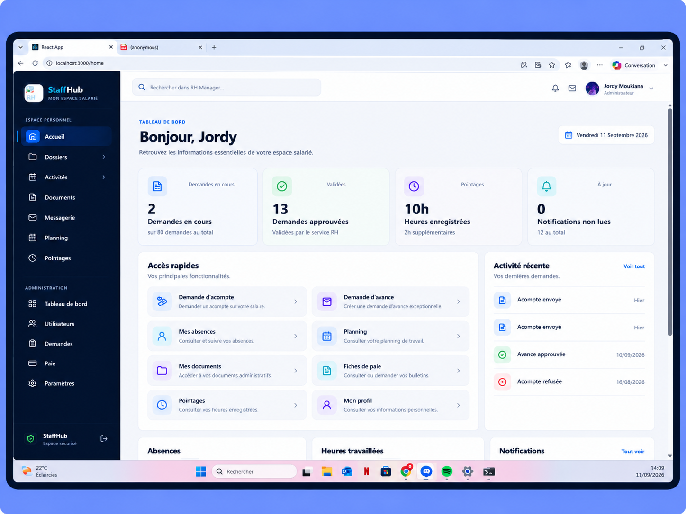

I-- StaffHub

StaffHub is a web application for managing employee information and common HR workflows in one place. Employees can view their records and submit requests; HR staff can manage employees, review requests, and monitor activity.

I built StaffHub independently as my Portfolio Project during the Full-Stack Web Development program at Holberton School.



II-- What the application does

| Employees | HR and administrators |
| --- | --- |
| View and update their profile | Create and manage employee records |
| Submit and track HR requests | Approve or reject requests |
| Access documents, schedules, and payroll information | Review employee and absence statistics |
| View attendance, notifications, and messages | Manage HR information according to their permissions |

Requests include salary advances, advance payments, overtime, and CET payments. The available actions depend on the user's role and the rules enforced by the backend.

III-- Tech stack

| Layer | Technologies |
| --- | --- |
| Frontend | React, JavaScript, Axios, Recharts, CSS |
| Backend | Python, Django, Django REST Framework, SimpleJWT |
| Database | SQLite in local development; PostgreSQL in production |
| Deployment | Vercel for the frontend; Render for the backend |

IV-- Architecture

The React frontend calls a REST API provided by Django REST Framework. The backend validates requests, applies business rules and permissions, and reads or writes data through Django's ORM.

```text
React frontend
      │ REST API
      ▼
Django REST Framework
      │ Models and ORM
      ▼
Database
```

Authentication uses JWT. Access to protected API resources is checked on the backend according to the authenticated user and their role. The interface also adapts to the user's role.

V-- Database design

The database separates employees, requests, documents, schedules, attendance, payroll, and messages into related tables. For example, a request belongs to an employee through a foreign key. This lets StaffHub retrieve an employee's requests without duplicating the employee's information in every request.

Django models define these relationships, and migrations apply schema changes to the database.

> Add a clear database diagram here if one is available in the repository.

## Getting started

### Requirements

- Python 3
- Node.js and npm
- The environment variables required by the Django configuration

### 1. Clone the repository

```bash
git clone https://github.com/MOUKIANA-jordy/STAFFHUB.git
cd STAFFHUB
```

## 2. Start the backend

```bash
cd backend
python3 -m venv venv
source venv/bin/activate
pip install -r requirements.txt
python3 manage.py migrate
python3 manage.py runserver
```

The API runs locally at `http://127.0.0.1:8000/`.

Create a local `.env` file in `backend/` with the variables required by your configuration. For example:

```dotenv
SECRET_KEY=replace-with-a-local-development-secret
DEBUG=True
ALLOWED_HOSTS=localhost,127.0.0.1
CORS_ALLOWED_ORIGINS=http://localhost:3000
CSRF_TRUSTED_ORIGINS=http://localhost:3000
```

Do not commit `.env` or real credentials to Git.

### 3. Start the frontend

Open a second terminal:

```bash
cd STAFFHUB/frontend
npm install
npm start
```

The frontend runs locally at http://localhost:3000/.

If your frontend configuration requires REACT_APP_API_URL, point it to your local backend in frontend/.env:

```dotenv
REACT_APP_API_URL=http://127.0.0.1:8000
```

Restart the React development server after changing its environment variables.

## API overview

The API includes endpoints for employee profiles, requests, documents, schedules, attendance, payroll, notifications, and messaging.

| Resource | Example endpoint |
| --- | --- |
| Current user | `GET /api/me/` |
| Employees | `GET /api/salaries/` |
| Requests | `GET /api/demandes/` |
| Documents | `GET /api/documents/` |
| Planning | `GET /api/planning/` |
| Attendance | `GET /api/pointage/` |
| Payroll | `GET /api/paie/` |
| Notifications | `GET /api/notifications/` |

Protected endpoints require authentication. The available operations depend on the user's role. API documentation is available through Swagger when running the configured documentation route.

# Technical decisions and challenges

**Permissions.** StaffHub handles employee and HR workflows in the same application. Backend permissions determine which data and actions each authenticated user can access.

Separate deployments. The React frontend and Django backend run as separate services. This required configuring the API address, allowed origins, hosts, environment variables, and production database.

Relational data. Employee information is connected to requests, documents, schedules, and other records through model relationships. Django migrations keep database changes reproducible across environments.

Authentication. Connecting the frontend to protected API endpoints required handling JWT authentication and keeping client and server configuration consistent.

## Current scope and next steps

The project includes employee profiles, HR requests, documents, planning, attendance, payroll-related features, notifications, messaging, password reset, and an HR dashboard.

Planned improvements include broader automated test coverage, accessibility work, mobile usability improvements, and more detailed HR analytics.

### Author

Jordy Wenceslas Moukiana
  
Full-Stack Web Development student, Holberton School

- [LinkedIn](https://www.linkedin.com/in/jordy-wenceslas-moukiana-636842274)
- [X / Twitter](https://x.com/Jordinateur_242)
- [Project repository](https://github.com/MOUKIANA-jordy/STAFFHUB)
